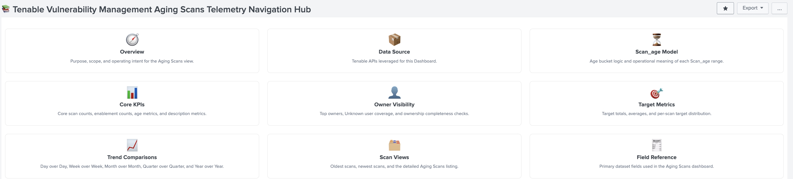
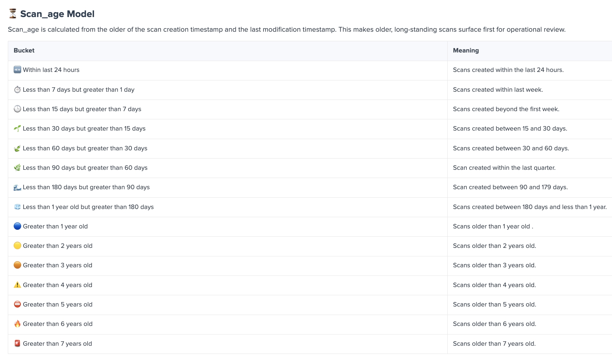

# tenable_vm_scan_extractor.py

## Overview
Full extraction utility for **Tenable Vulnerability Management aged scan analysis**. Extract and preserve **scan names**, **scan inventory**, **scan detail metadata**, and **merged scan output** from the Tenable Vulnerability Management API for exporting all the scans to produce key performance indicators for age of scans.

The application uses the Tenable Vulnerability Management REST API to retrieve all scans that have been created extract the per-scan detail metadata.
All data is retrieved through **read-only API operations** and written into structured CSV outputs for aging scan metrics

The script implements a deterministic **three-pass workflow**:

- **Pass 1**: export scan inventory, including authoritative scan names, to CSV
- **Pass 2**: retrieve per-scan detail metadata using `scan_id` and export to CSV
- **Pass 3**: merge inventory CSV and detail CSV into a final merged dataset for aged scan analysis

This enables Vulnerability Management Operations resources, 3rd party auditors and Executive visibility to:

- Retrieve all scans that have been created
- validate proxy connectivity before extraction
- validate API connectivity before extraction
- validate package dependencies availability before runtime
- track records retrieved, processed, written, and failed for each pass
- track scan names retrieved, processed, written, and failed for each pass
- log execution details to both console and logfile
- monitor execution progress with `tqdm` progress bars for each pass
- identify aged scans
- extract scan names from the `name` field
- provide the ability review scan inventory at scale
- retrieve detailed scan metadata for each scan
- generate merged CSV outputs for aged scan analytics


The script writes the following outputs:

- `tenable_vm_scans_inventory.csv`
- `tenable_vm_scans_details.csv`
- `tenable_vm_scans_merged.csv`
- `tenable_vm_scan_extractor.log`

The authoritative scan-name field for this workflow is:

```text
name
```

Pass 1 establishes the authoritative scan-name count.  
Pass 2 should match that count.  
Pass 3 should match that count.


## ⚠️ Disclaimer

This tool is **not an official BitSight product**.

Use of this software is **not covered** by any license, warranty, or support agreement you may have with BitSight.

## ⚠️ Disclaimer

This tool is **not an official Tenable product**.

Use of this software is **not covered** by any license, warranty, or support agreement you may have with Tenable.

All functionality is implemented independently using publicly available Tenable Vulnerability Management API endpoints.

## Features

### 🛡️ Core Capabilities
| Feature | Description |
|---------|-------------|
| 📥 Scan Inventory Extraction | Retrieve scan inventory records from Tenable Vulnerability Management |
| 🏷️ Scan Name Extraction | Extract authoritative scan names from the `name` field |
| 🔎 Scan Detail Retrieval | Retrieve detailed scan metadata using `scan_id` |
| 🔗 CSV Merge Workflow | Merge inventory and detail exports into a final aged-scan analysis dataset |
| 📄 Multi-CSV Output | Write inventory, detail, and merged records to CSV |
| 📋 Read-Only API Operations | Uses API `GET` requests only |
| 🪵 Console and Logfile Logging | Write execution activity to both console and logfile |
| ⏱️ Per-Pass Metrics | Write complete pass metrics for Pass 1, Pass 2, and Pass 3 |
| 📊 Progress Tracking | Display `tqdm` progress bar for each pass |

### 📈 Analysis & Processing
| Feature | Description |
|---------|-------------|
| 🧾 Inventory Preservation | Preserve authoritative scan inventory from Pass 1 |
| 🏷️ Scan Name Continuity | Preserve scan-name continuity across all passes |
| 🔄 Pass Correlation | Use `scan_id` to correlate inventory and detail records |
| 📚 Detail Enrichment | Enrich inventory records with per-scan detail metadata |
| 📦 Final Merged Dataset | Produce merged CSV output for aged scan review and reporting |
| 🕒 Runtime Tracking | Capture start, end, and execution time for each pass |
| 📌 Record Accounting | Capture retrieved, processed, written, and failed counts for each pass |

### ⚙️ Operational Excellence
| Feature | Description |
|---------|-------------|
| ✅ Dependency Validation | Validate required Python packages before runtime |
| 🌐 Proxy Validation | Validate outbound proxy connectivity before extraction |
| 🔐 API Validation | Validate Tenable VM API connectivity before extraction |
| 📋 Unix-Style Logging | Use timestamped structured operational logs |
| 🧱 Deterministic Workflow | Consistent three-pass processing model |
| 🧪 Build Ready | Can be packaged into a standalone executable with `pyinstaller` |

## Workflow

| Pass | Description | Output |
|------|-------------|--------|
| **Pass 1** | Retrieve scan inventory and export authoritative scan names and inventory metadata | `tenable_vm_scans_inventory.csv` |
| **Pass 2** | Use `scan_id` from Pass 1 to retrieve detailed scan metadata | `tenable_vm_scans_details.csv` |
| **Pass 3** | Merge Pass 1 inventory and Pass 2 details into final output | `tenable_vm_scans_merged.csv` |

## 🚀 Deployment
| Feature | Description |
|---------|-------------|
| 🖥️ Cross-Platform Execution | Supports macOS, Linux, Windows PowerShell, and Windows CMD |
| 📄 CSV Outputs | Produces inventory, detail, and merged CSV artifacts |
| 🪵 Dual Logging | Writes to both console and logfile |
| 📊 Per-Pass Progress | Displays `tqdm` progress bar for each pass |
| 📦 Standalone Packaging | Supports `pyinstaller` one-file builds |

## Installation

### Step 1: Configure the Script
1. Open `tenable_vm_scan_extractor.py`
2. Update the API configuration values:
   - `BASE_URL`
   - `ACCESS_KEY`
   - `SECRET_KEY`
3. Update proxy settings if required by your environment

#### API Configuration
```python
BASE_URL = "https://cloud.tenable.com"
ACCESS_KEY = "ACCESS_KEY"
SECRET_KEY = "SECRET_KEY"
```

#### Proxy Configuration
```python
PROXIES = {
    "http": "http://proxy.company.com:8080",
    "https": "http://proxy.company.com:8080",
}
```

#### HTTP Headers
```python
HEADERS = {
    "accept": "application/json",
    "X-ApiKeys": f"accessKey={ACCESS_KEY}; secretKey={SECRET_KEY}",
}
```

### Step 2: Install Dependencies

#### macOS / Linux
```bash
python3 -m venv .venv
source .venv/bin/activate
python3 -m pip install --upgrade pip
pip install requests tqdm colorama
```

#### Windows PowerShell
```powershell
py -3 -m venv .venv
.\.venv\Scripts\Activate.ps1
py -3 -m pip install --upgrade pip
pip install requests tqdm colorama
```

#### Windows CMD
```cmd
py -3 -m venv .venv
.venv\Scripts\activate.bat
py -3 -m pip install --upgrade pip
pip install requests tqdm colorama
```

If dependencies are missing, the script logs the missing packages and exits with code `1`.

### Step 3: Validate Connectivity
1. Run the script after configuration
2. The script validates dependency availability
3. The script validates proxy connectivity
4. The script validates API connectivity before extraction begins

### Step 4: Run the Script
Execute the script:

```bash
python3 tenable_vm_scan_extractor.py
```

### Step 5: Verify Output Files
After execution, verify that the following files were created:

- `tenable_vm_scans_inventory.csv`
- `tenable_vm_scans_details.csv`
- `tenable_vm_scans_merged.csv`
- `tenable_vm_scan_extractor.log`

## Directory Structure
```text
.
├── tenable_vm_scan_extractor.py
├── tenable_vm_scan_extractor.log
├── tenable_vm_scans_inventory.csv
├── tenable_vm_scans_details.csv
└── tenable_vm_scans_merged.csv
```

## Output Files

| File | Description |
|------|-------------|
| `tenable_vm_scans_inventory.csv` | Pass 1 inventory export |
| `tenable_vm_scans_details.csv` | Pass 2 detail export |
| `tenable_vm_scans_merged.csv` | Pass 3 merged export |
| `tenable_vm_scan_extractor.log` | Logfile |

## Metrics

### Per-Pass Metrics
At the end of **each pass**, the script writes complete metrics to both:

- console
- logfile

| Metric | Description |
|--------|-------------|
| `start_timestamp_utc` | Pass start time in UTC |
| `end_timestamp_utc` | Pass end time in UTC |
| `start_time_local` | Pass start time in local time |
| `end_time_local` | Pass end time in local time |
| `records_retrieved` | Number of records loaded for the pass |
| `records_processed` | Number of records processed |
| `records_failed` | Number of processing failures |
| `records_written` | Number of rows written |
| `scan_names_retrieved` | Number of rows with non-empty `name` |
| `scan_names_processed` | Number of scan names processed |
| `scan_names_failed` | Number of scan-name processing failures |
| `scan_names_written` | Number of scan names written |
| `execution_time_seconds` | Pass runtime in seconds |

### Scan Name Integrity
| Rule | Description |
|------|-------------|
| **Authoritative Field** | `name` |
| **Pass 1** | Establishes the authoritative scan-name count |
| **Pass 2** | Should preserve the Pass 1 scan-name count |
| **Pass 3** | Should preserve the Pass 1 scan-name count |

## Logging

### Console and Log File
The script writes to:

- console
- logfile

Default logfile:

```text
tenable_vm_scan_extractor.log
```

### Log Format
```text
%(asctime)s [%(levelname)s] %(name)s[%(process)d]: %(message)s
```

### Severity Levels
- `INFO`
- `WARN`
- `ERROR`
- `CRIT`
- `DEBUG`

## Requirements

- Python 3.8+
- Network access to Tenable Vulnerability Management
- Valid Tenable VM API credentials
- Proxy access if required by your environment
- Python libraries:
  - `requests`
  - `tqdm`
  - `colorama`

## Build Standalone Executable

This script can be packaged as a standalone executable with `pyinstaller`.

### Install build dependency
```bash
pip install pyinstaller
```

### Build on macOS
```bash
pyinstaller --onefile tenable_vm_scan_extractor.py
```

Output:

```text
dist/tenable_vm_scan_extractor
```

### Build on Windows
```powershell
pyinstaller --onefile tenable_vm_scan_extractor.py
```

Output:

```text
dist\tenable_vm_scan_extractor.exe
```

Build on each target operating system separately.

## Troubleshooting

### Missing dependencies
Install required packages:

```bash
pip install requests tqdm colorama
```

### Proxy validation failure
Verify:

- proxy URL
- proxy port
- outbound connectivity
- authentication requirements in your environment

### API validation failure
Verify:

- `BASE_URL`
- `ACCESS_KEY`
- `SECRET_KEY`
- proxy connectivity
- Tenable Vulnerability Management API availability

### Pass 2 scan-name counts do not match Pass 1
The script design expects Pass 2 to preserve the authoritative `name` count from Pass 1.

Inspect:

- `tenable_vm_scans_inventory.csv`
- `tenable_vm_scans_details.csv`
- logfile messages for failed scan detail requests

### Pass 3 scan-name counts do not match Pass 1
The script design expects Pass 3 to preserve the authoritative `name` count from Pass 1.

Inspect:

- `tenable_vm_scans_inventory.csv`
- `tenable_vm_scans_details.csv`
- `tenable_vm_scans_merged.csv`
- logfile messages for merge failures

## Support

- Tenable Vulnerability Management API documentation
- Python documentation
- Internal operational runbooks and aged scan analysis workflows

## License

Apache License 2.0

Copyright (c) 2025 Mark Teicher

Permission is hereby granted, free of charge, to any person obtaining a copy of this software and associated documentation files (the "Software"), to deal in the Software without restriction, including without limitation the rights to use, copy, modify, merge, publish, distribute, sublicense, and/or sell copies of the Software, and to permit persons to whom the Software is furnished to do so, subject to the following conditions:

The above copyright notice and this permission notice shall be included in all copies or substantial portions of the Software.

THE SOFTWARE IS PROVIDED "AS IS", WITHOUT WARRANTY OF ANY KIND, EXPRESS OR IMPLIED, INCLUDING BUT NOT LIMITED TO THE WARRANTIES OF MERCHANTABILITY, FITNESS FOR A PARTICULAR PURPOSE AND NONINFRINGEMENT. IN NO EVENT SHALL THE AUTHORS OR COPYRIGHT HOLDERS BE LIABLE FOR ANY CLAIM, DAMAGES OR OTHER LIABILITY, WHETHER IN AN ACTION OF CONTRACT, TORT OR OTHERWISE, ARISING FROM, OUT OF OR IN CONNECTION WITH THE SOFTWARE OR THE USE OR OTHER DEALINGS IN THE SOFTWARE.
